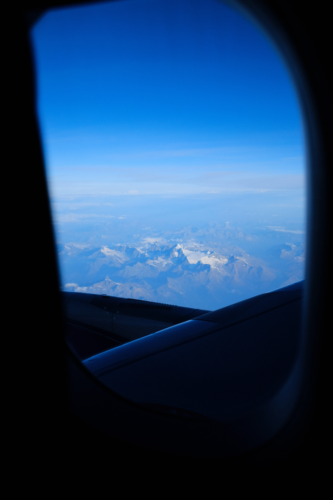

_Above the mountains, September 10_

---

Flat snowfield among a ring of peaks on a mountaintop. Like a tarn, or mountain lake, only made of snow. I imagine what it would be like to get to the ridge and after a long climb enter the circle of peaks, the snow in front of me. A meadow at thousands of feet, where ice crystals bloom instead of flowers. Standing at the top of the world and still encircled, hugged, protected. The field, the pristine snow my secret playground. Only the rocks around seeing me, and the airplanes above.

