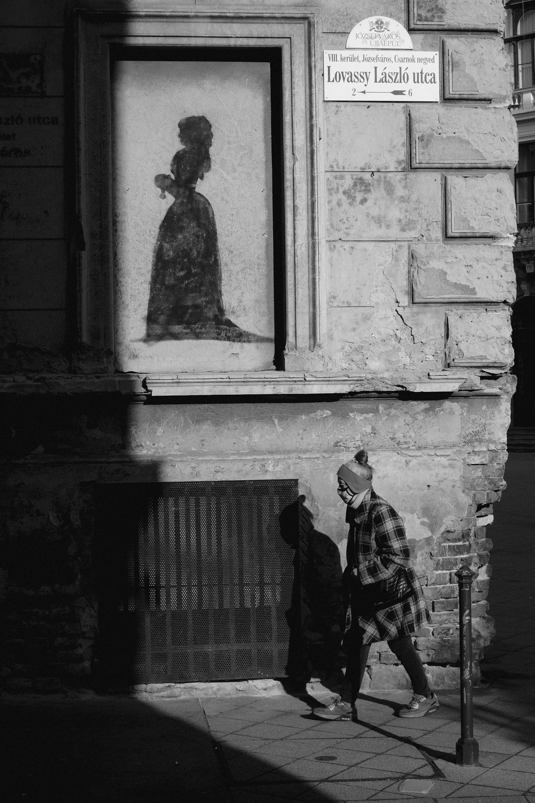
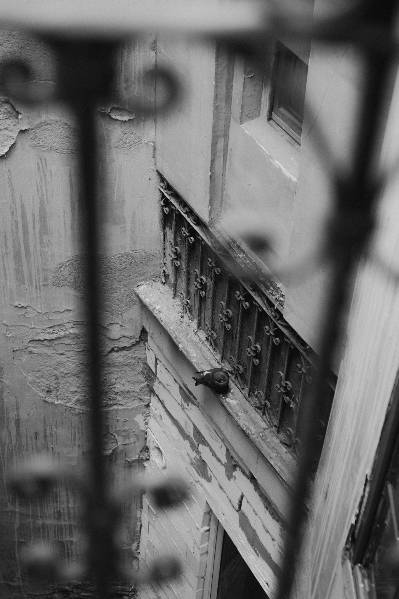
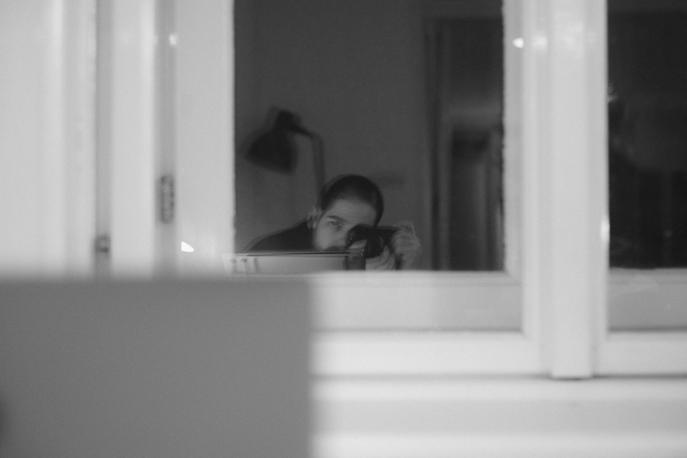

I’m trying something new for my day-to-day photography: digital film rolls. I read this idea somewhere, sadly I don’t remember where, but here’s the gist:
Set up a digital camera and shoot it as if it were on film. For me this has the benefit of being able to edit digital files later (including a lot of flexibility with RAWs). At the same time, my goal is to slow down a bit and focus on the small moments in my life instead of fretting about pictures not being technically perfect.

My setup is a Fujifilm X-Pro1 with a manual 35mm lens and an SD card formatted so it only fits 36 shots. Along with the limited storage, the camera is pretty old and with the manual lens it feels much closer to a film camera. I also set a rule for myself: I can’t look at or delete pictures in the camera. Whatever I shoot stays on the card and I won’t find out how it turned out until the card is full and I load it up on my computer.

- - - - - -

These are my favorite pictures from the first “digital roll” that I shot over the weekend. I didn’t spend much time taking pictures, rather I just had the camera with me and shot whatever moments I felt like documenting.

