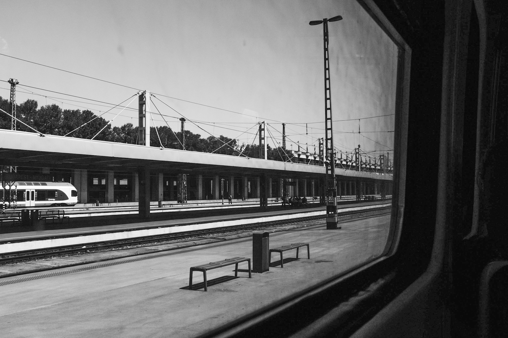

You walk to the train station just before noon, when the sun is harshest. You do this every day, and every day you swear to yourself that tomorrow you will leave earlier, avoid the worst of the heat. Then tomorrow comes and there you are again, never earlier than 11 in the morning.

This heatwave is not worse than last year’s, except that you were secretly hoping that cool, rainy June would leave its soft breezes behind for mild July. Instead, June itself, as if jealous to be ending, has turned angry, hot.

Now you walk to the train and the whole city feels like a frying pan, heat piercing the sky and radiating from the ground and the buildings all around. This city wasn’t designed for people. It was designed for grandiose plans on architects’ drawing boards and for machines, chugging around, buses and trains and cars and generators, and air conditioners, heating the streets even more as they cool the melting humans inside.

The station is even hotter than the street, its steel posts holding roofs over nothing but more empty concrete. A group of workers with no work to do, or perhaps no more will to do it, sweat quietly, bare chests shining under dirty hi-viz wests. A backpacker in loose fitting shorts, dragging himself across the station in the 40 degree heat, shifting, like a fried egg whose yolk has almost stopped running.

Among the eclectic, worn down, rust colored buildings and signs a spot of modern design: a steel framed trash bin, painted black so it sucks up and radiates back even more heat. The trash inside is slowly cooking behind over-designed, walnut colored wooden sides.
All the benches are under the open sky, blasted by the noon sun. Across the seats are sharp bars to prevent the homeless and the stranded from sleeping on them. The wise designers shouldn’t have worried. The benches are so hot, noone even tries to sit on them, sleeping would be impossible.

The train finally starts moving, its diesel engine roaring, struggling to keep the air conditioning on. Maybe tomorrow it will rain a little.
