Scrolling through my photo archive I see the same images show up again and again. Not good photos, just the opposite. Pointless, useless photos. The view outside our home office window. (There is an open corridor and you can see the apartment opposite ours.) The view of the kitchen from the office door. A top down view of my messy desk, cluttered with chargers and devices.

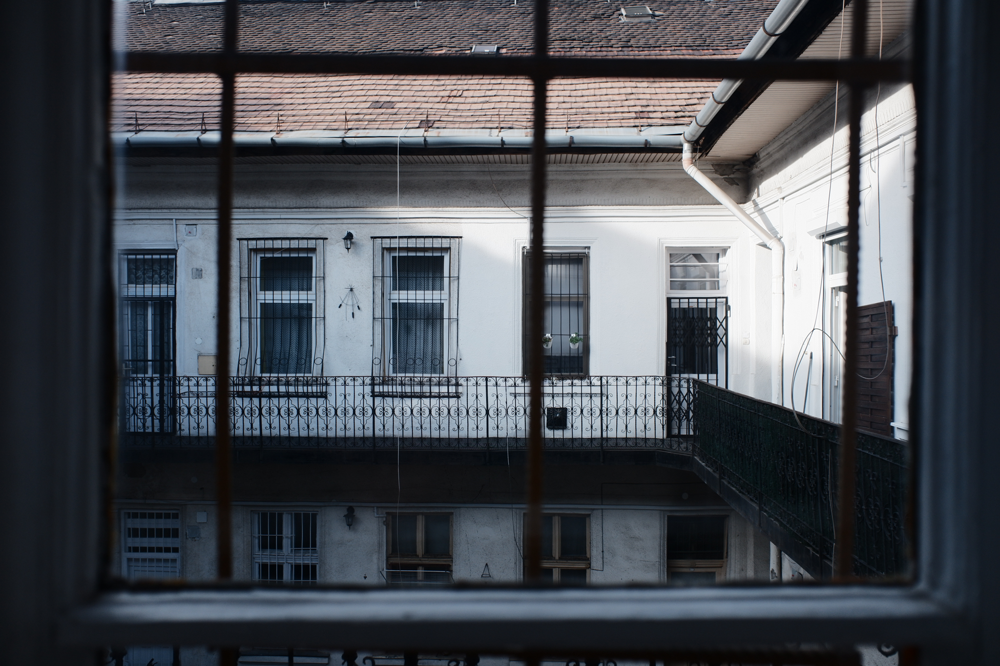
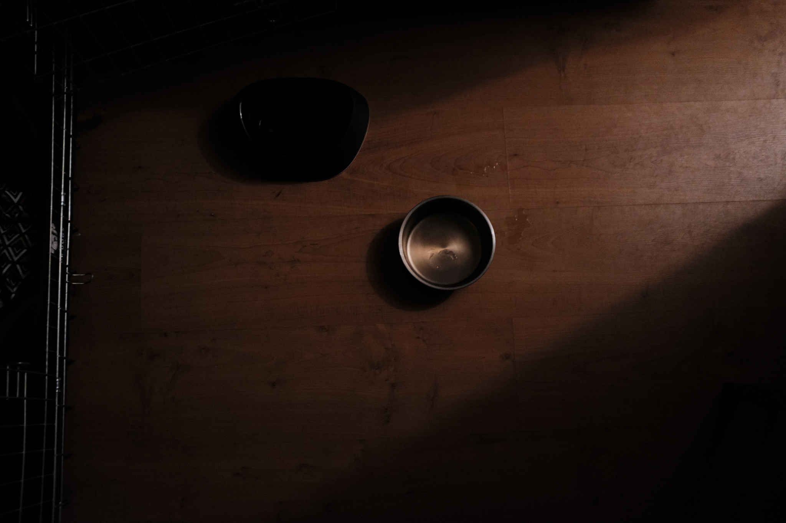

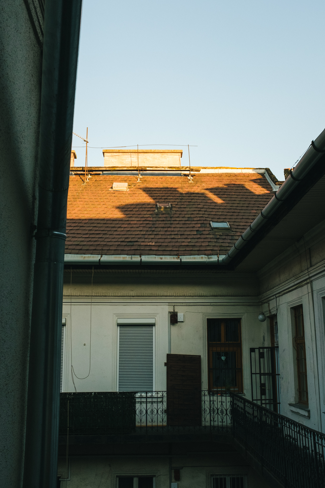
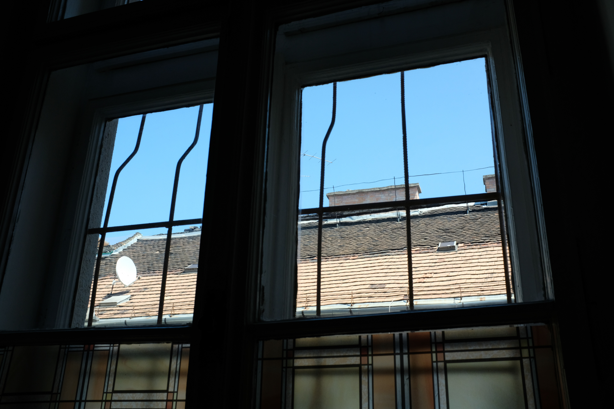

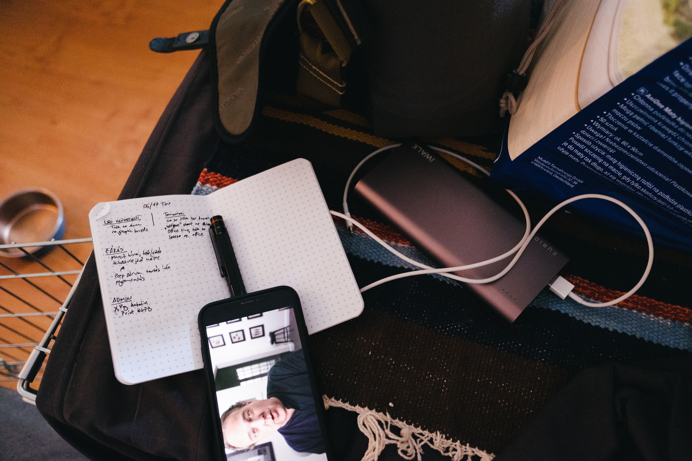
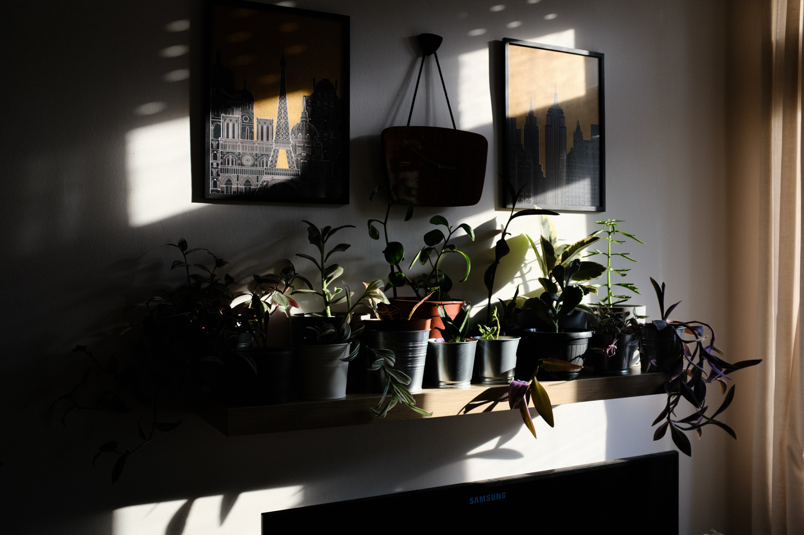

I take these pictures to comfort myself. Just holding the camera and tripping the shutter, even if it’s pointless, feels good.

When I was little, I had a red race car, pedal-propelled, with a real steering wheel and a proper seat. I would sit in it sometimes even when I couldn’t go outside to drive it because I had to get ready for school or be in bed already or it was raining outside. I would sit in that race car for a few minutes, just to feel like it was still mine. Sitting there I could imagine the possibilities, that tomorrow or at the weekend I /could/ take it out and drive it and it would be glorious. Even when I couldn’t go on an adventure around the yard, just sitting in the car, just touching it reassured me that sometime soon I would go and have a marvelous time. Sometime soon I would be the kind of kid who drove a red plastic race car.

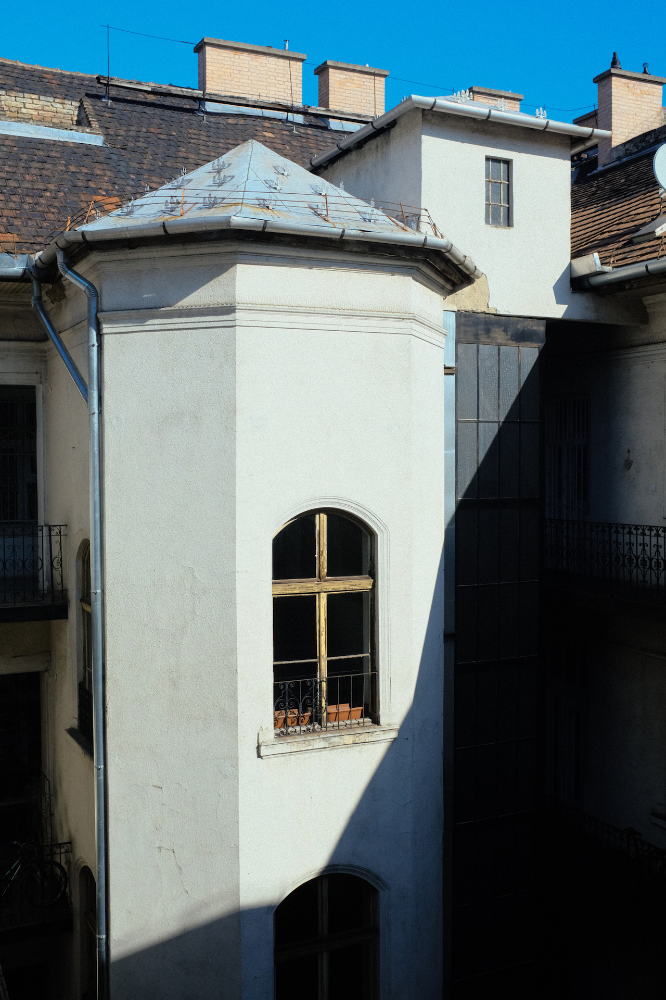
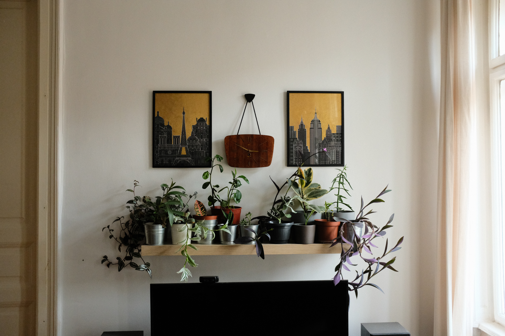
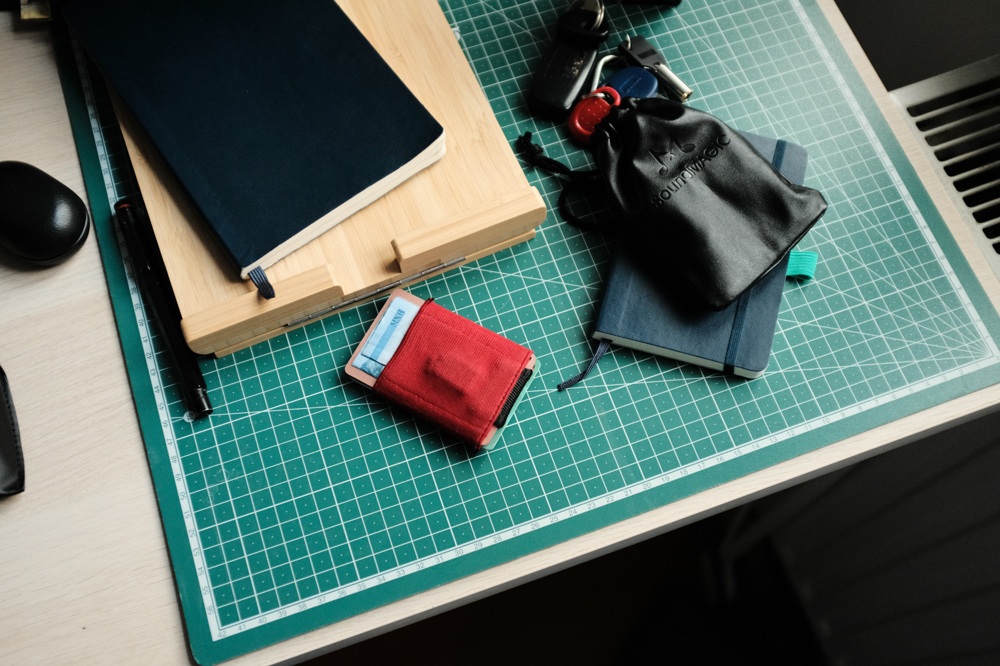
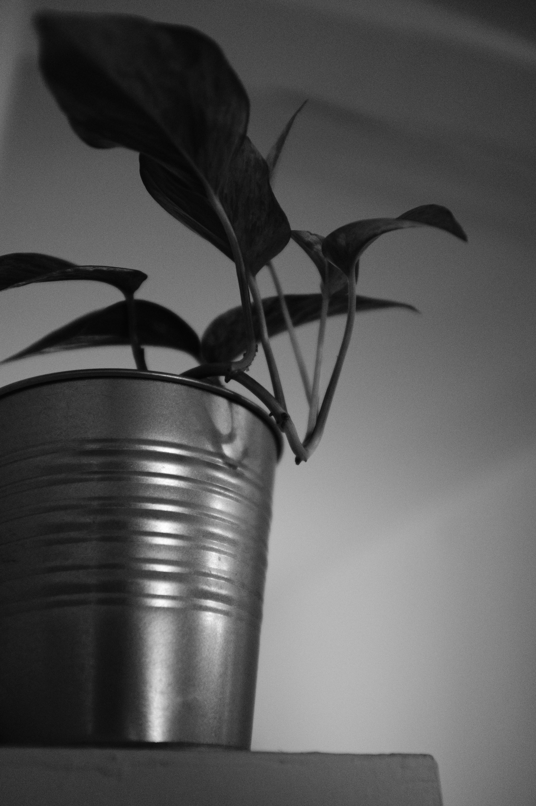
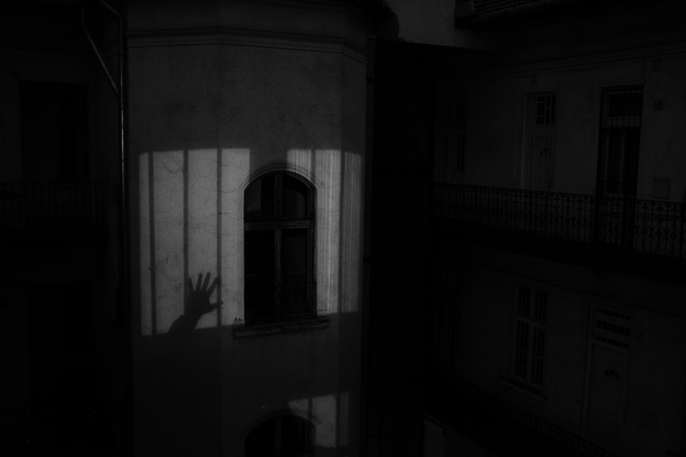
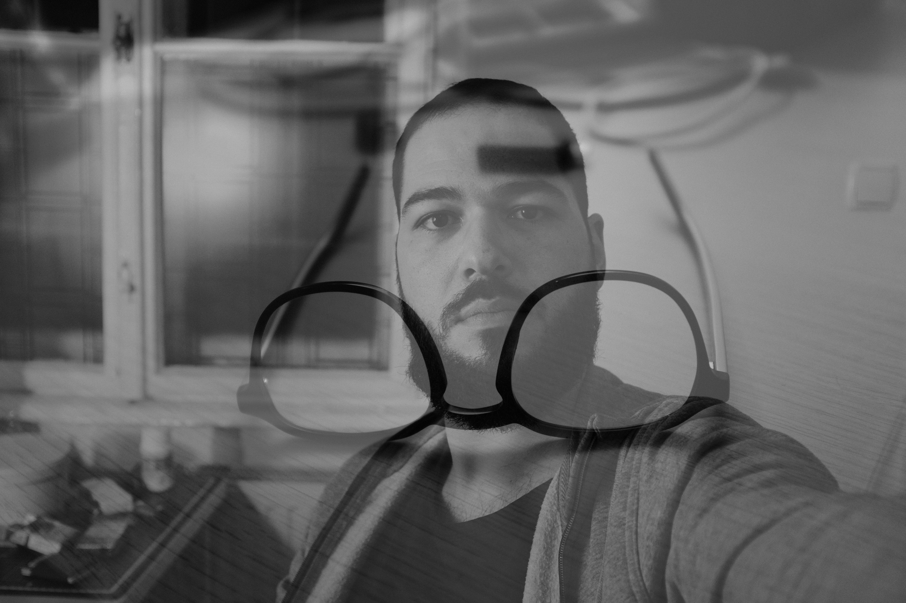
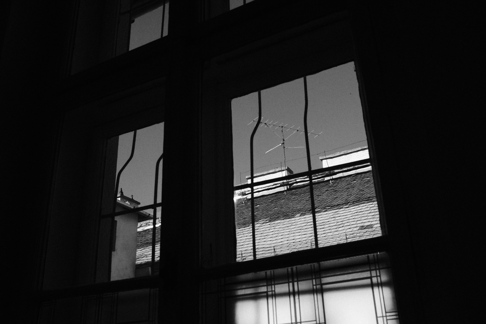
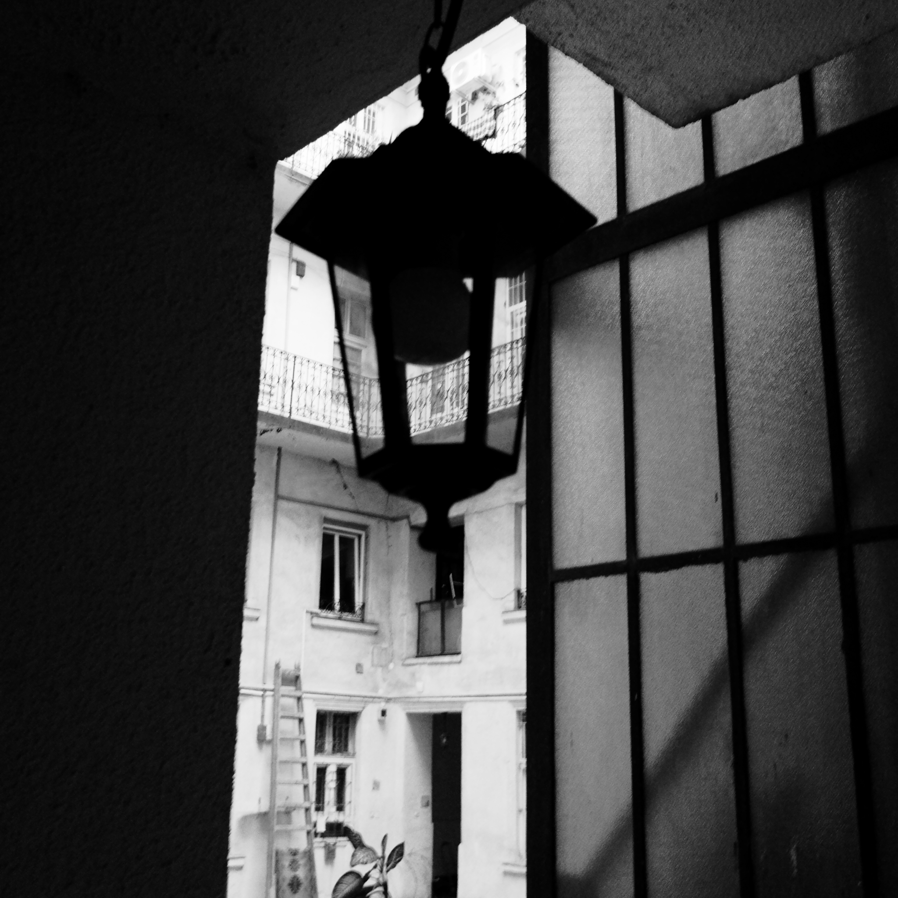

Even when the time isn’t right, I can still use a little physical reminder that tomorrow or the day after, or sometime soon it would be. And boy will I feel good that day, confident, immersed in taking photos, feeling like a badass with my cool camera and creative ideas and awesome red plastic sports car.
