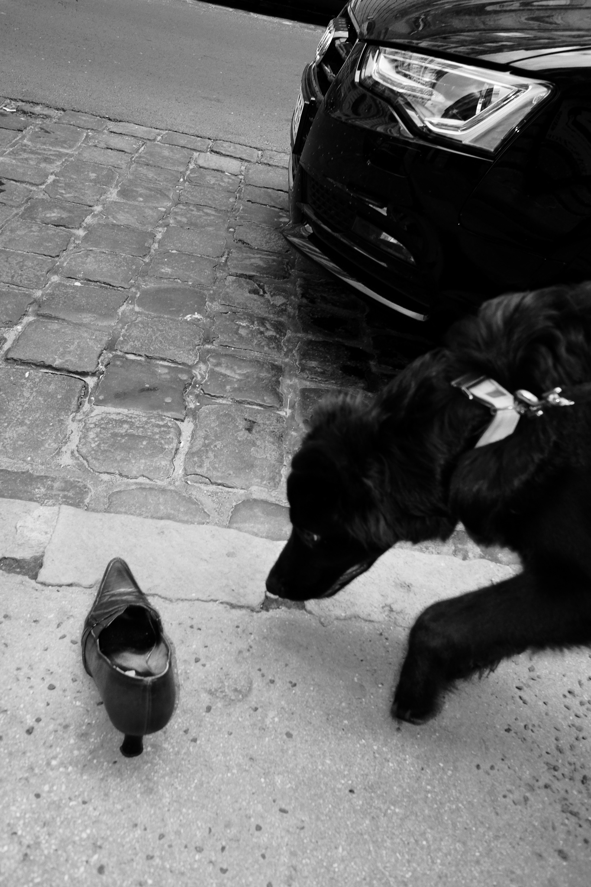

+++
title = "1 - Harapós Bácsi"
date = "2021-12-20T19:22:29+02:00"
slug = "1-harapos-bacsi"
tags = ["hu","vignette",]
+++

Van egy bácsi a környékünkön, aki, nem tudok jobb kifejezést, a cimborája a kutyámnak. Nem nekem, a kutyának. Persze nem jár a kutya kocsmába amíg én munkában vagyok, az egész teljesen alkoholmentes és a jelenlétemben történik. De a jelenlétem igazából mellékes nekik, ebben a kapcsolatban nem sok szerepem van.

Minden reggel ott áll a bácsi a kis pincetemplom előtt, szívja a szivarkáját, és csak a kutyával kommunikál.
Amikor befordulunk a sarkon, meglátják egymást a kutyával. Tádé rögtön fellelkesül, csóválja a farkát és amennyire csak a póráztól tud, rohan a bácsi elé. A bácsi is örül, vigyorog a kopott baseball sapkája alatt, és ahogy Tádé a közelébe ér (én is, de ugye ez mindegy), a következőket mondja:

> Grrr, hát megharaplak! Vigyázz, megharaplak! Hogy ugrálsz, mi, hát megharaplak!

Tádé láthatóan nagyon örül ennek a lehetőségnek, és lelkesen dörgölőzik a bácsi lábához, aki közben fülig érő szájjal fenyegeti, hogy most már tényleg megharapja. Mármint a bácsi a kutyát, nyilván.
Velem nem szokott beszélgetni a bácsi, csak köszön, mikor tovább indulunk a kutyával, hogy "Helló!", kicsit zavarban van ilyenkor, hogy tényleg, itt ácsorog ez az ember is. De hát nem én vagyok a cimborája, hanem a kutya, szóval érthető.

Egyszer volt eddig, hogy a bácsi nem akarta megharapni a kutyát nagy örömében. Amikor befordultunk a sarkon, a pincetemplom bejárata előtt többen is ácsorogtak, 7-8 fekete öltönyös meg kosztümös ember, halkan, szinte suttogva csevegtek és dohányoztak. Temetés lehetett vagy emlék istentisztelet, láthatóan gyászos volt az alkalom.
A bácsi is ki volt öltözve, ugyanis egy rövid ujjú fehér ing volt rajta a szokásos melegítőfelső helyett. Ahogy közeledtünk, komoly arccal Tádéra nézett, a szája elé tette a mutatóujját és azt suttogta:

> Shhh, most nem haraplak meg, ma szépen kell lenni.
